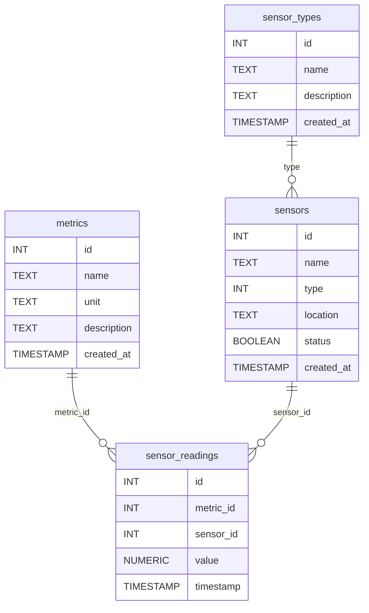

# Metrics API demo
Simple API which is using uWebsockets and returning the data from PostgreSQL database.

## Quickstart (Docker)
Run code below in docker
```
docker-compose build
docker-compose up
```

Access API via
```
curl http://localhost:9000/metrics
```
or web browser

## Database schema
Abstract database schema can be found below


